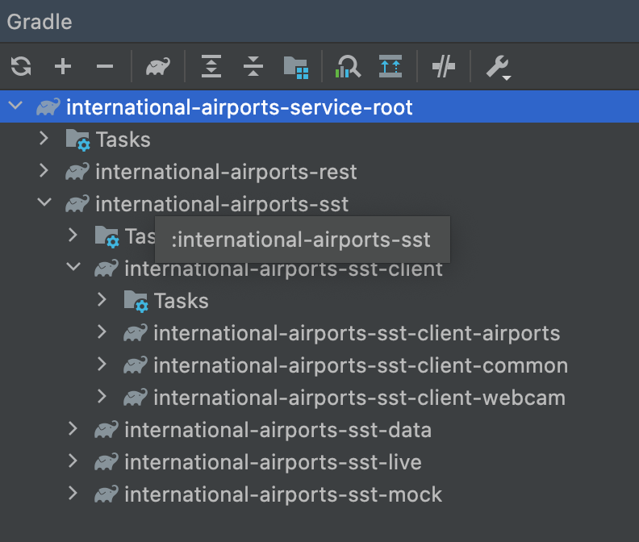

# international-airports-service-root - Troubleshooting

1. Gradle doesn't build in Intellij

If after running `make b`, Intellij still doesn't recognize the dependecies just click the refresh button for the gradle plugin as below is illustrated:

